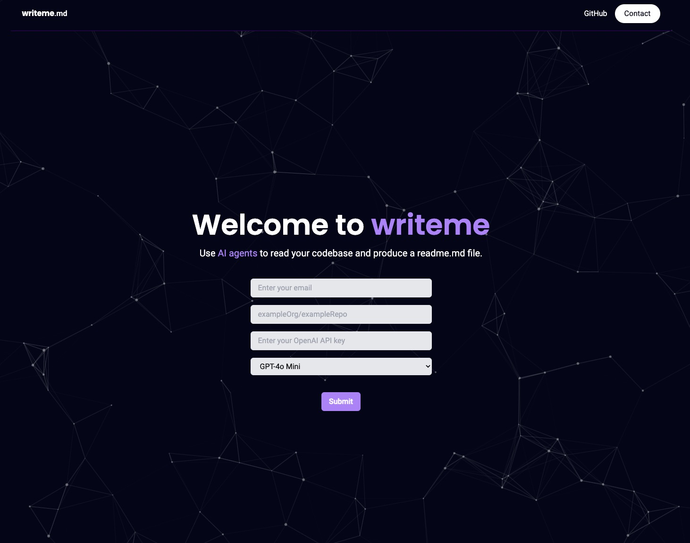

# writeme.md



## Description
`writeme.md` is an automated tool designed to generate `README.md` files by analysing the code in your codebase. It leverages the power of `autogen`, a framework that deploys AI agents to create a custom, informative `README.md` based on the specific contents and structure of your project.

The tool is built on a microservice architecture using **Kubernetes** and **Docker** to manage and scale its various components. **RabbitMQ** is used as the message broker for handling task queues, while **MongoDB** stores information about processed requests, including generated `README.md` files and repository data.

Currently, it only works on `Python` files.

WIP - host on GCP

## Setup

### 1. Git Clone
Clone the repo:
```
git clone git@github.com:WDoyle123/writeme.md.git
cd writeme.md
```

### 2. Update /etc/hosts
Add the following entry to your `/etc/hosts` file:
```
127.0.0.1 writeme.com
```

### 3. Gmail Account Configuration
To enable notification features, you will need to create a Gmail account and configure it as follows:

- Generate a pass key for your Gmail account.
- Add this key to the file located at:  
  `manifest/notifications/readme-notifications-secret.yaml`

### 4. Prerequisites
Ensure you have the following dependencies installed:

- **Minikube**
- **Docker**
- **Kubernetes**

### 5. Run Setup Script
After verifying the prerequisites, navigate to the `scripts` directory and run the `setup.sh` script to configure the environment:

```bash
cd scripts
./setup.sh
```

# Example:

There are some areas for improvement but `writeme.md` provides a solid base for the user to make final changes.

# wdoyle123/tuits

## Description

Tuits is a command-line interface (CLI) tool designed for task management. It allows users to log tasks, track their workday, and generate summaries of their productivity over specified time frames. The application supports various functionalities including starting and finishing workdays, logging tasks with optional messages, displaying tasks based on different time frames (day, week, month, year), managing database backups, and generating task summaries.

## Setup

To set up the Tuits application, follow these steps:

1. **Clone the repository**:
   ```bash
   git clone https://github.com/wdoyle123/tuits.git
   cd tuits
   ```

2. **Install dependencies**:
   Ensure you have Python installed, then install the required packages:
   ```bash
   pip install -r requirements.txt
   ```

3. **Initialize the database**:
   Run the following command to set up the database:
   ```bash
   python tuits.py init_db
   ```

4. **Run the application**:
   You can start using the application by running:
   ```bash
   python tuits.py
   ```

## Usage

Here are some examples of how to use the Tuits application:

- **Start work**:
  ```bash
  python tuits.py start
  ```

- **Log a task**:
  ```bash
  python tuits.py log "Task Name" -m "Task details"
  ```

- **Show tasks for today**:
  ```bash
  python tuits.py show day
  ```

- **Backup the database**:
  ```bash
  python tuits.py backup save
  ```

- **Generate a summary of tasks for the week**:
  ```bash
  python tuits.py summary week --api_key YOUR_API_KEY
  ```

- **Remove a task**:
  ```bash
  python tuits.py remove
  ```

## Technologies Used

- **Python**: The primary programming language used for developing the application.
- **SQLite**: A lightweight database used for storing tasks and logs.
- **Command-Line Interface (CLI)**: The application is designed to be used via the command line, providing a straightforward user experience.
- **shutil**: A Python module used for file operations, particularly for managing database backups.

This project is a great tool for anyone looking to improve their productivity and keep track of their tasks efficiently.
